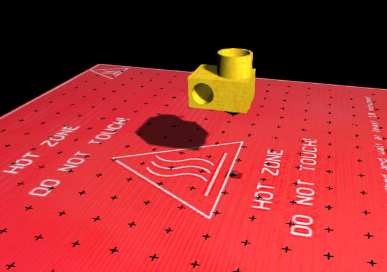

# simreprap
emulates en entire reprap 3D printer running a Marlin firmware binary, renders it in opengl

Uses simavr to emulate the Marlin binary, and allows you to connect pronterface to the simavr 'virtual uart' port 
to send commands to the 'printer'.
The emulator also simulates thermistors, hotbed, stepper motors and endstops!

Emulation lacks laying down some 'plastic' but it still quite fun.

